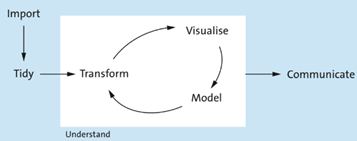

# README INTRODUCTION
This README contains information regarding the features used in this data set.
For this Data Science task, the Hadley-Wickham method is used to investigate the data provided by the 'Electricity System Operator' (ESO) and by 'Strom- und Gasmarktdaten' (SMARD) of the German 'Bundesnetzagentur. The method steps of Hadley-Wickham are shown in the image below.

Sources of the raw data (2024/09/28):
https://www.neso.energy/, 
https://www.smard.de/home

# classImporter.py
Contains the **Importer*** class to import data from national grid 'Electricity System Operator' (ESO) of Great Britain (GB) and from 'Bundesnetzagentur' in Germany.
#### Methods:
    - combine_eso
    - combine_smard

# classTidy.py
Contains the **Tidy** class for an initial data structuring by printing information of the raw data and standardizing the time stamps for further processing
#### Methods:
    - df_info
    - standardize_time

# classTransformer.py
Contains the **Transformer** class and its methods to transform the read in raw data into a format that is suitable for a regression task. 
#### Methods:
    - manipulate_esolog
    - manipulate_smardlog
    - set_time_span
    - analyze_df_mismatches
    - align_dataframes
    - prepare_for_regression
    - merge_dataframes

# DataPerparation.py
Contains a **DataProcessor** class combining the code of Import, Tidy and Transformer to provide prepare data for the tasks in the subsequent steps of the Hadley-Wickham method.
#### Methods:
    - __post_init__
    - process_eso_data
    - process_smard_data
    - process_all_data
    - save_dataframes_to_csv
    - main

# **NOTE**
> **Up this point, the project is processed with python scripts (.py). Further model tasks Visualization, Modelling, Communication will be handled with Jupyter Notebooks (.ipnyb). Information and results are saved to the 'processed' directory.**
 

# classVisualizer.ipnyb

# classModeler.ipnyb

# classCommunicator.ipnyb
