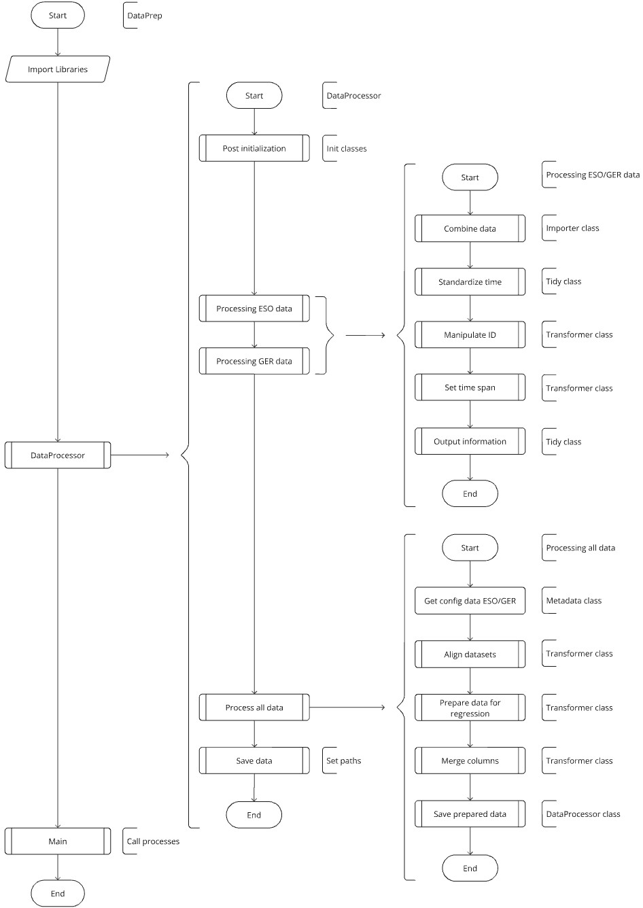

# **RENDER: ctrl+shift+V**

**Content:**  
INTRODUCTION  
INSTRUCTION   
DATAPREP   
NOTE  
VISMODCOM   
TIME

# **INTRODUCTION** 
Original Author: marius.rauen@rfh-campus.de

Content Introduction: Project structre and processed data. 
Content Instruction: Software execution  
Used analysis workflow: Hadley-Wickham method 

#### AIM:
The aim of the project is to predict one author defined feature of the dataset. For this project work, this feature is overall demand of the United Kingdom, Germany respectively with the label 'TARGET'.  
For the ESO data, this corresponds to the feature 'ENGLAND_WALES_DEMAND'.  
For the GER data, this corresponds to the feature 'Stromverbrauch_Gesamt (Netzlast) [MWh]'.

#### Sources of the raw data (2024/09/28):
'Electricity System Operator' (ESO) for data of the United Kindgom. 
'Strom- und Gasmarktdaten' (SMARD) for of German (GER) 'Bundesnetzagentur. 

| Name                                                      | Source                                                                                    | 
|-----------------------------------------------------------|-------------------------------------------------------------------------------------------|  
| **National Energy System Operator (ESO) (UK)**            | https://www.neso.energy/                                                                  |                                           
| Daily Balancing Services Use of System (BSUoS) Cost Data  | https://www.neso.energy/data-portal/daily-balancing-costs-balancing-services-use-system   |
| Daily Balancing Services Use of System (BSUoS) Volume Data| https://www.neso.energy/data-portal/daily-balancing-volume-balancing-services-use-system  |
| Historic Demand Data                                      | https://www.neso.energy/data-portal/historic-demand-data                                  |
| Historic generation mix and carbon intensity              | https://www.neso.energy/data-portal/historic-generation-mix                               |
| System Inertia                                            | https://www.neso.energy/data-portal/system-inertia                                        |
| **Strom- und Gasmarkdaten (SMARD) (GER)**                 | https://www.smard.de/home/downloadcenter/download-marktdaten/                             |
| Physikalischer Stromfluss                                 | Link -> Oberkategorie: Markt                                                              |
| Realisierte Erzeugung                                     | Link -> Oberkategorie: Stromerzeugung                                                     |
| Realisierter Stromverbrauch                               | Link -> Oberkategorie: Stromverbrauch                                                     |
| Ausgleichsenergie                                         | Link -> Oberkategorie: Systemstabilitaet                                                  |
| Exportierte Regelenergie                                  | Link -> Oberkategorie: Systemstabilitaet                                                  |
| Importierte Regelenergie                                  | Link -> Oberkategorie: Systemstabilitaet                                                  |
| Kosten                                                    | Link -> Oberkategorie: Systemstabilitaet                                                  |
| Minutenreserve                                            | Link -> Oberkategorie: Systemstabilitaet                                                  |
| Primaerregelreserve                                       | Link -> Oberkategorie: Systemstabilitaet                                                  |
| Sekundaerregelreserve                                     | Link -> Oberkategorie: Systemstabilitaet                                                  |

# **INSTRUCTION**
> **Get project from https://github.com/mariusrauen/rh-fnnp and connect Docker container.   Get raw data and implement in data initialized data directory of the project.   Run DataPrep.py to generate the data for the steps Visualise, Model and Communicate.   After that, execute VisModCom.py to Visualise, Model and Communicate.**

# **DATAPREP**
#### Methods of classMetaData.py:
    - get_configs
    - setup_logger

#### Methods of classImporter.py:
    - combine_eso
    - combine_smard

#### Methods of classTidy.py:
    - df_info
    - standardize_time

#### Methods of classTransformer.py:
    - manipulate_esolog
    - manipulate_smardlog
    - set_time_span
    - analyze_df_mismatches
    - align_dataframes
    - prepare_for_regression
    - merge_dataframes

## DataPerp.py
Contains the DataProcessor class that ties the MetaData, Importer, Tidy, Transformer together.

    - __post_init__
    - process_eso_data
    - process_smard_data
    - process_all_data
    - save_dataframes_to_csv
    - main

# **NOTE**
> **Up this point, the project steps Import, Tidy and Transform are treated in 'DataPrep.py'.   Further model steps Visualization, Modeling and Communication are handled in 'VisModCom.py'.   Information related to the used and processed datasets are saved to the directory that is named 'processed'.   Information and results regarding the models are saved to the directory that is named 'models'.**
  
# **VISMODCOM**
#### Visualization

#### Modeler
For modeling, the pytorch library is used:  
https://pytorch.org/tutorials/beginner/nlp/sequence_models_tutorial.html  
https://pytorch.org/docs/stable/generated/torch.nn.LSTM.html   

#### Communicator

## VisModCom.py
This file contains the steps for Visualization, Modeling and Communication.

# **TIME**
Target: 6CP = 6 x 25h = 150h

Lecture: CW37 (2024/09/09) until CW52 (2024/12/23) = 16 weeks with 3h/week = 48h - 6h (canceled lectures) = 42h

Project: 128h + 42h = 170h 

| Date       | CW        | Start      | End        | Break      | h [day]   | h [sum]   | Comment                            | 
|------------|-----------|------------|------------|------------|-----------|-----------|------------------------------------|                  
| 2024/09/28 | 39        | 08:00      | 14:00      | 01:00      | 05:00     | 005:00     | Init Project, seach data          |
| 2024/10/05 | 40        | 09:00      | 14:00      | 01:00      | 04:00     | 009:00     | Inform about Docker               |
| 2024/10/12 | 41        | 09:00      | 15:00      | 01:00      | 06:00     | 015:00     | Setup Project, implement Docker   |
| 2024/10/19 | 42        | 08:00      | 19:00      | 01:00      | 10:00     | 025:00     | First read in, inital strucutre   |
| 2024/10/31 | 44        | 14:00      | 17:00      | 00:00      | 03:00     | 028:00     | Setup git                         |
| 2024/11/01 | 44        | 09:00      | 19:00      | 04:00      | 06:00     | 034:00     | Work on Importer                  |  
| 2024/11/03 | 44        | 08:00      | 18:00      | 01:00      | 09:00     | 043:00     | Work on Tidy, Transformer         |
| 2024/11/09 | 45        | 07:00      | 15:00      | 01:00      | 07:00     | 050:00     | Work on Tidy, Transformer         |
| 2024/11/11 | 45        | 18:30      | 21:30      | 00:00      | 03:00     | 053:00     | Work on Tidy, Transformer         |
| 2024/11/15 | 46        | 08:00      | 14:00      | 02:00      | 04:00     | 057:00     | Restructure code                  |
| **End Data Preperation**                                                                                                   |
| 2024/11/16 | 46        | 09:00      | 18:00      | 02:00      | 07:00     | 064:00     | Setup notebooks, validate code    |
| 2024/11/19 | 47        | 19:00      | 21:00      | 00:00      | 02:00     | 066:00     | Visualize                         |
| 2024/11/20 | 47        | 09:00      | 14:00      | 00:00      | 05:00     | 071:00     | Normalize and heatmap             |
| 2024/11/21 | 47        | 15:30      | 18:00      | 00:00      | 02:30     | 073:30     | Start modeling                    |
| 2024/11/22 | 47        | 09:00      | 14:00      | 03:00      | 04:30     | 078:00     | LSTM initial model structure      |
| 2024/11/23 | 47        | 09:00      | 12:00      | 00:00      | 03:00     | 081:00     | LSTM model                        |
| 2024/11/24 | 47        | 13:00      | 16:00      | 00:00      | 03:00     | 084:00     | LSTM model                        |
| 2024/11/27 | 48        | 09:00      | 16:00      | 01:00      | 06:00     | 090:00     | LSTM model                        |
| 2024/11/28 | 48        | 08:00      | 21:00      | 02:00      | 11:00     | 101:00     | LSTM model                        |
| 2024/11/29 | 48        | 08:00      | 10:00      | 00:00      | 02:00     | 103:00     | LSTM model                        |
| 2024/11/30 | 48        | 09:00      | 19:30      | 01:30      | 09:00     | 112:00     | Toss .ipynb, troubleshooting      |
| 2024/12/01 | 48        | 10:00      | 16:30      | 01:30      | 05:00     | 117:00     | LSTM model, clean environment     |
| 2024/12/19 | 51        | 10:00      | 11:00      | 00:00      | 01:00     | 118:00     | LSTM model                        |
| 2024/12/23 | 52        | 17:00      | 21:00      | 00:00      | 04:00     | 122:00     | Markdown                          |
| 2024/12/24 | 52        | 10:00      | 16:00      | 00:00      | 06:00     | 128:00     | Clean code, Presentation          |
| 2024/12/27 | 52        | 14:00      | 18:00      | 00:00      | 04:00     | 132:00     | Presentation                      |
| **End of Project**                                                                                                         |