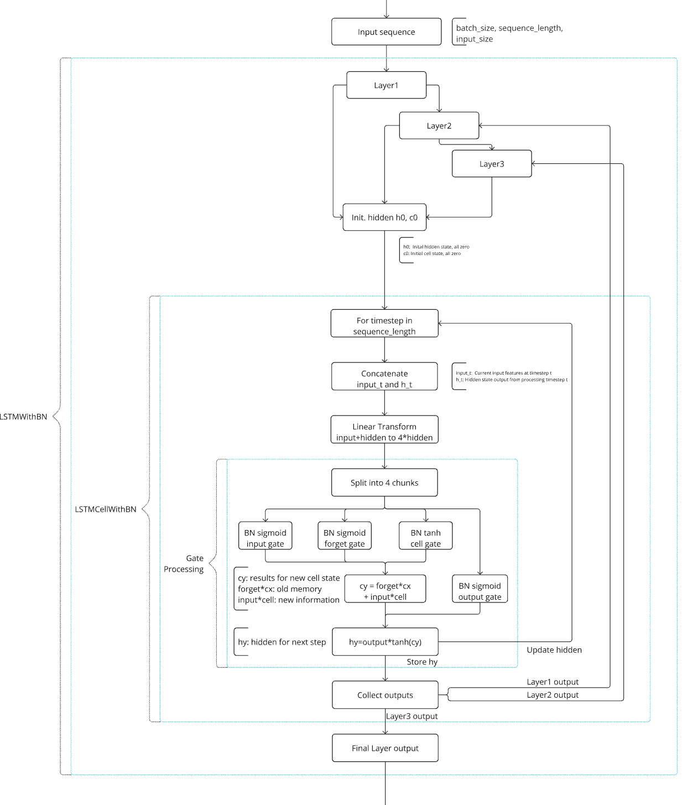
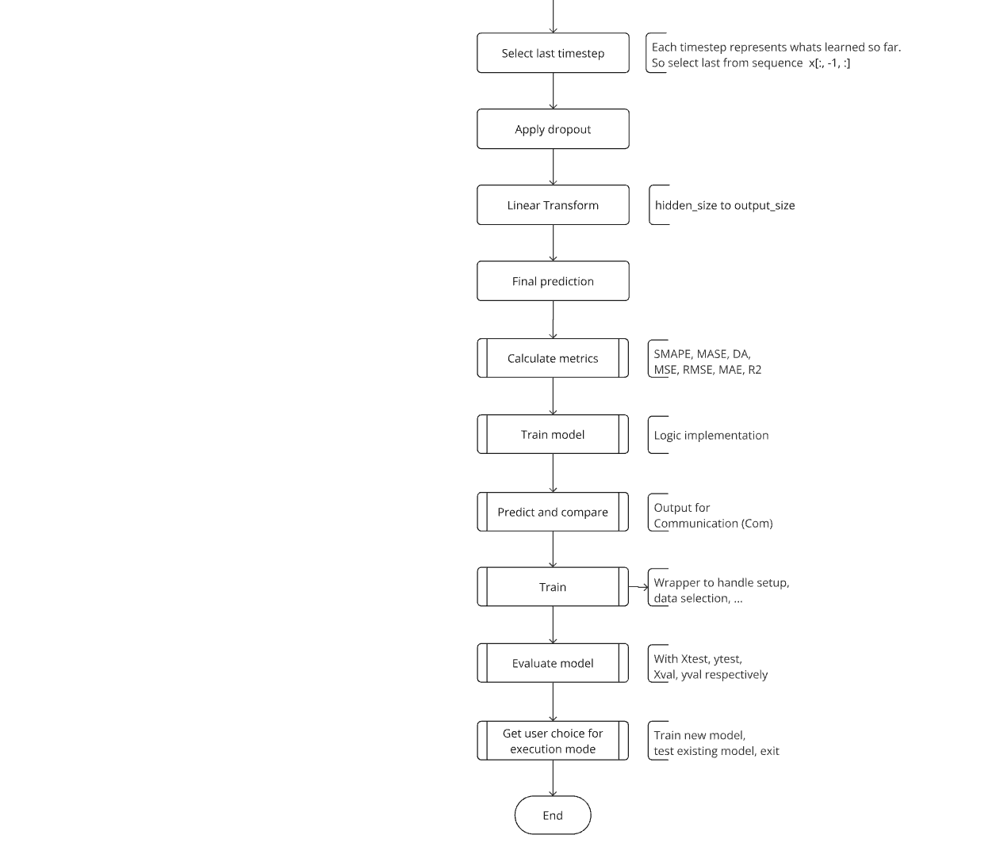

# **RENDER: ctrl+shift+V**

**Content:**  
INTRODUCTION  
INSTRUCTION   
DATAPREP   
NOTE  
VISMODCOM   
TIME

# **INTRODUCTION** 
Original Author: marius.rauen@rfh-campus.de

Content Introduction: Project structre and processed data. 
Content Instruction: Software execution  
Used analysis workflow: Hadley-Wickham method 

#### AIM:
The aim of the project is to predict one author defined feature of the dataset. For this project work, this feature is overall demand of the United Kingdom, Germany respectively with the label 'TARGET'.  
For the ESO data, this corresponds to the feature 'ENGLAND_WALES_DEMAND'.  
For the GER data, this corresponds to the feature 'Stromverbrauch_Gesamt (Netzlast) [MWh]'.

#### Sources of the raw data (2024/09/28):
'Electricity System Operator' (ESO) for data of the United Kindgom. 
'Strom- und Gasmarktdaten' (SMARD) for of German (GER) 'Bundesnetzagentur. 

| Name                                                      | Source                                                                                    | 
|-----------------------------------------------------------|-------------------------------------------------------------------------------------------|  
| **National Energy System Operator (ESO) (UK)**            | https://www.neso.energy/                                                                  |                                           
| Daily Balancing Services Use of System (BSUoS) Cost Data  | https://www.neso.energy/data-portal/daily-balancing-costs-balancing-services-use-system   |
| Daily Balancing Services Use of System (BSUoS) Volume Data| https://www.neso.energy/data-portal/daily-balancing-volume-balancing-services-use-system  |
| Historic Demand Data                                      | https://www.neso.energy/data-portal/historic-demand-data                                  |
| Historic generation mix and carbon intensity              | https://www.neso.energy/data-portal/historic-generation-mix                               |
| System Inertia                                            | https://www.neso.energy/data-portal/system-inertia                                        |
| **Strom- und Gasmarkdaten (SMARD) (GER)**                 | https://www.smard.de/home/downloadcenter/download-marktdaten/                             |
| Physikalischer Stromfluss                                 | Link -> Oberkategorie: Markt                                                              |
| Realisierte Erzeugung                                     | Link -> Oberkategorie: Stromerzeugung                                                     |
| Realisierter Stromverbrauch                               | Link -> Oberkategorie: Stromverbrauch                                                     |
| Ausgleichsenergie                                         | Link -> Oberkategorie: Systemstabilitaet                                                  |
| Exportierte Regelenergie                                  | Link -> Oberkategorie: Systemstabilitaet                                                  |
| Importierte Regelenergie                                  | Link -> Oberkategorie: Systemstabilitaet                                                  |
| Kosten                                                    | Link -> Oberkategorie: Systemstabilitaet                                                  |
| Minutenreserve                                            | Link -> Oberkategorie: Systemstabilitaet                                                  |
| Primaerregelreserve                                       | Link -> Oberkategorie: Systemstabilitaet                                                  |
| Sekundaerregelreserve                                     | Link -> Oberkategorie: Systemstabilitaet                                                  |

# **INSTRUCTION**
> **Get project from https://github.com/mariusrauen/rh-fnnp and connect Docker container.   Get raw data and implement in data initialized data directory of the project.   Run DataPrep.py to generate the data for the steps Visualise, Model and Communicate.   After that, execute VisModCom.py to Visualise, Model and Communicate.**

# **DATAPREP**
#### Methods of classMetaData.py:
    - get_configs
    - setup_logger

#### Methods of classImporter.py:
    - combine_eso
    - combine_smard

#### Methods of classTidy.py:
    - df_info
    - standardize_time

#### Methods of classTransformer.py:
    - manipulate_esolog
    - manipulate_smardlog
    - set_time_span
    - analyze_df_mismatches
    - align_dataframes
    - prepare_for_regression
    - merge_dataframes

## DataPerp.py
Contains the DataProcessor class that ties the MetaData, Importer, Tidy, Transformer together.

    - __post_init__
    - process_eso_data
    - process_smard_data
    - process_all_data
    - save_dataframes_to_csv
    - main

# **NOTE**
> **Up this point, the project steps Import, Tidy and Transform are treated in 'DataPrep.py'.   Further model steps Visualization, Modeling and Communication are handled in 'VisModCom.py'.   Information related to the used and processed datasets are saved to the directory that is named 'processed'.   Information and results regarding the models are saved to the directory that is named 'models'.**
  
# **VISMODCOM**
#### Functions of Visualization
    - setup_logger
    - inspect_data
    - plot_data
    - plot_correlation_heatmap

#### Functions in Modeler section (not in classes)
For modeling, the pytorch library is used:  
https://pytorch.org/tutorials/beginner/nlp/sequence_models_tutorial.html  
https://pytorch.org/docs/stable/generated/torch.nn.LSTM.html   

 
    - normalize
    - inspect_data
    - calculate metrics
    - train_model (core implementation)
    - predict_and_compare
    - train (wrapper for setup train_model)
    - evaluate_model
    - analyze_metrics_by_period
    - get_user_choice
    - def get_dataset_choice
    - get_timestamp

#### Classes of Modeler (Methods within not listed)
    - ModelConfig
    - TimeSeriesDataset
    - LSTMWithBN
    - LSTMCellWithBN
    - LSTMPredictor

## VisModCom.py
This file contains the steps for Visualization, Modeling and Communication.

# **PARAMETERS**

**INPUT IN VisModCom.py AROUND LINE 265 TO 295**

**sequence_length**  
Datapoints for one prediction. Set LSTM cells processed in parallel  
Increase: Get long term patterns, learn historical pattern, high memory usage  
Decrease: Faster training, may miss long term patterns, good for short term dependence data

**batch_size**  
Sequences processed together in one iteration  
Increase: Stable gradient estimates, good parallel processing, higher memory usage  
Decrease: Frequent parameter update, more noise in training, less memory usage

**hidden_size**  
Number of units in one layer  
Increase: Capacity for complex patterns, higher memory usage  
Decrease: Faster training, less risk of overfitting, risk of underfitting

**num_layers**  
Number of hidden layers  
Increase: Can learn hierarchical features, high complexity, vanishing/exploding gradients  
Decrease: Faster Training, less risk of overfitting, reduce complexity

**learning_rate**  
Impacts the steps for the gradient  
Increase: Fast initial learning, risk of overshooting optima, risk of training instability  
Decrease: More stable training, better final convergence, slower initial training

**grad_clip**  
Limits the gradient step  
Increase: Larger parameter updates, faster training, risk of instability  
Decrease: More stable training, slower training, good handling of exploding gradients

**epochs**  
An epoch corresponds to one pass through the model  
Increase: More time to find good parameters, good chance of convergence, risk of overfitting  
Decrease: Faster training, risk of stop before good solution, less chance of overfitting

**dropout**  
Removes units in the hidden_size  
Increase: Stronger regularization, better generalization, can slow down learning  
Decrease: Faster learning, less regularization, risk of overfitting

**patience**  
Number of epochs to wait for improvement before stopping  
Increase: Chance to escape plateaus, slower training, sisk of wasting resources  
Decrease: Early stopping on plateaus, faster training, risk of missing late improvements

**scheduler_patience**  
Defines when fine tuning at local minima starts  
Increase: Longer current learning rate, less frequent rate change, may waste time on plateaus  
Decrease: Faster adaption of learning rate, more aggressive optimization, may reduce to quickly if low

**scheduler_factor**  
Helps to fine tune the model in a local minima. Set grad decreasing  
Increase: Gentle learning rate decay, slower adaption to plateaus, stable training  
Decrease: Faster learning rate decay, faster adaption to plateaus, can escape plateaus better

# **METRICS**
**MSE (Mean Squared Error)** 
**Average of squared differences between predictions and actual values, penalizing larger errors more heavily** 
**Range 0...$\infty$, the lower the better**  
**$MSE = \frac{1}{n} \cdot \sum (actual-predicted)^2$**

**RMSE (Root Mean Square Error)**  
Square root of MSE, giving error in same units as original data  
Range 0...$\infty$, the lower the better, same unit as data  
$RMSE = \sqrt{MSE}$

**NMSE (Normalized Mean Square Error)** 
MSE normalized by the square of the mean, making it scale-independent  
Range 0...$\infty$, the lower the better  
$NMSE = \frac{MSE}{mean(actual)^2}$

**SMSE (Standardized Mean Square Error)**  
MSE normalized by variance, showing error relative to data variability  
Range 0...$\infty$, the lower the better  
$SMSE = \frac{MSE}{variance(actual)}$

**MAE (Mean Absolute Error)**  
**Average absolute difference between predictions and actual values, treating all errors equally**  
**Range 0...$\infty$, the lower the better, same unit as data**  
**$ MAE = \frac{1}{n} \cdot \sum |actual-predicted|$**

**MASE (Mean Absolute Scaled Error)**  
Compares your model's performance against a naive forecast (using "yesterday's value" as prediction)  
Range 0...$\infty$, the lower the better, <1 means better than naive forecast 
$MASE = \frac{MAE}{mean(|actual_t-actual_{t-1}|)}$ 

**SMAPE (Symmetric Mean Absolute Percentage Error)**  
Measures percentage error symmetrically, treating over and under-predictions equally  
Range: 0% to 100%, the lower the better  
$SMAPE = \frac{1}{n} \cdot \sum \frac{(|actual-predicted|)\cdot 2}{(|actual|+|predicted|)}\cdot 100$

**R² (R-squared)**  
**Proportion of variance in the target variable that's predictable from the model**  
**Range: $-\infty$ to 1, the higher the better (1 is perfect prediction)**  
**$R^2 = 1 - \frac{\sum (actual-predicted)^2}{\sum (actual - mean)^2}$**

**DA (Directional Accuracy)**  
**Shows how often your model correctly predicts whether the value will go up or down**  
**Range: 0% to 100%, the higher the better (> 50% better than random)**  
**Percentage of correctly predicted directions of change**

# **TIME**
Target: 6CP = 6 x 25h = 150h

Lecture: CW37 (2024/09/09) until CW52 (2024/12/23) = 16 weeks with 3h/week = 48h - 6h (canceled lectures) = 42h

Project: 147h + 42h = 189h 

| Date       | CW        | Start      | End        | Break      | h [day]   | h [sum]   | Comment                            | 
|------------|-----------|------------|------------|------------|-----------|-----------|------------------------------------|                  
| 2024/09/28 | 39        | 08:00      | 14:00      | 01:00      | 05:00     | 005:00     | Init Project, seach data          |
| 2024/10/05 | 40        | 09:00      | 14:00      | 01:00      | 04:00     | 009:00     | Inform about Docker               |
| 2024/10/12 | 41        | 09:00      | 15:00      | 01:00      | 06:00     | 015:00     | Setup Project, implement Docker   |
| 2024/10/19 | 42        | 08:00      | 19:00      | 01:00      | 10:00     | 025:00     | First read in, inital strucutre   |
| 2024/10/31 | 44        | 14:00      | 17:00      | 00:00      | 03:00     | 028:00     | Setup git                         |
| 2024/11/01 | 44        | 09:00      | 19:00      | 04:00      | 06:00     | 034:00     | Work on Importer                  |  
| 2024/11/03 | 44        | 08:00      | 18:00      | 01:00      | 09:00     | 043:00     | Work on Tidy, Transformer         |
| 2024/11/09 | 45        | 07:00      | 15:00      | 01:00      | 07:00     | 050:00     | Work on Tidy, Transformer         |
| 2024/11/11 | 45        | 18:30      | 21:30      | 00:00      | 03:00     | 053:00     | Work on Tidy, Transformer         |
| 2024/11/15 | 46        | 08:00      | 14:00      | 02:00      | 04:00     | 057:00     | Restructure code                  |
| **End Data Preperation**                                                                                                   |
| 2024/11/16 | 46        | 09:00      | 18:00      | 02:00      | 07:00     | 064:00     | Setup notebooks, validate code    |
| 2024/11/19 | 47        | 19:00      | 21:00      | 00:00      | 02:00     | 066:00     | Visualize                         |
| 2024/11/20 | 47        | 09:00      | 14:00      | 00:00      | 05:00     | 071:00     | Normalize and heatmap             |
| 2024/11/21 | 47        | 15:30      | 18:00      | 00:00      | 02:30     | 073:30     | Start modeling                    |
| 2024/11/22 | 47        | 09:00      | 14:00      | 03:00      | 04:30     | 078:00     | LSTM initial model structure      |
| 2024/11/23 | 47        | 09:00      | 12:00      | 00:00      | 03:00     | 081:00     | LSTM model                        |
| 2024/11/24 | 47        | 13:00      | 16:00      | 00:00      | 03:00     | 084:00     | LSTM model                        |
| 2024/11/27 | 48        | 09:00      | 16:00      | 01:00      | 06:00     | 090:00     | LSTM model                        |
| 2024/11/28 | 48        | 08:00      | 21:00      | 02:00      | 11:00     | 101:00     | LSTM model                        |
| 2024/11/29 | 48        | 08:00      | 10:00      | 00:00      | 02:00     | 103:00     | LSTM model                        |
| 2024/11/30 | 48        | 09:00      | 19:30      | 01:30      | 09:00     | 112:00     | Toss .ipynb, troubleshooting      |
| 2024/12/01 | 48        | 10:00      | 16:30      | 01:30      | 05:00     | 117:00     | LSTM model, clean environment     |
| 2024/12/19 | 51        | 10:00      | 11:00      | 00:00      | 01:00     | 118:00     | LSTM model                        |
| 2024/12/23 | 52        | 17:00      | 21:00      | 00:00      | 04:00     | 122:00     | Markdown                          |
| 2024/12/24 | 52        | 10:00      | 16:00      | 00:00      | 06:00     | 128:00     | Clean code, Com., Presentation    |
| 2024/12/26 | 52        | 10:00      | 11:00      | 00:00      | 01:00     | 129:00     | Clean code, Com., Presentation    |
| 2024/12/28 | 52        | 11:00      | 21:00      | 03:00      | 07:00     | 136:00     | Com., Presentation                |
| 2024/12/29 | 52        | 10:00      | 18:00      | 02:00      | 06:00     | 142:00     | Com., Presentation                |
| 2024/12/30 | 52        | 10:00      | 13:00      | 00:00      | 03:00     | 145:00     | Com., Presentation                |
| 2025/01/03 | 01        | 18:00      | 20:00      | 00:00      | 02:00     | 147:00     | Com., Presentation                |
| **End of Project**                                                                                                         
